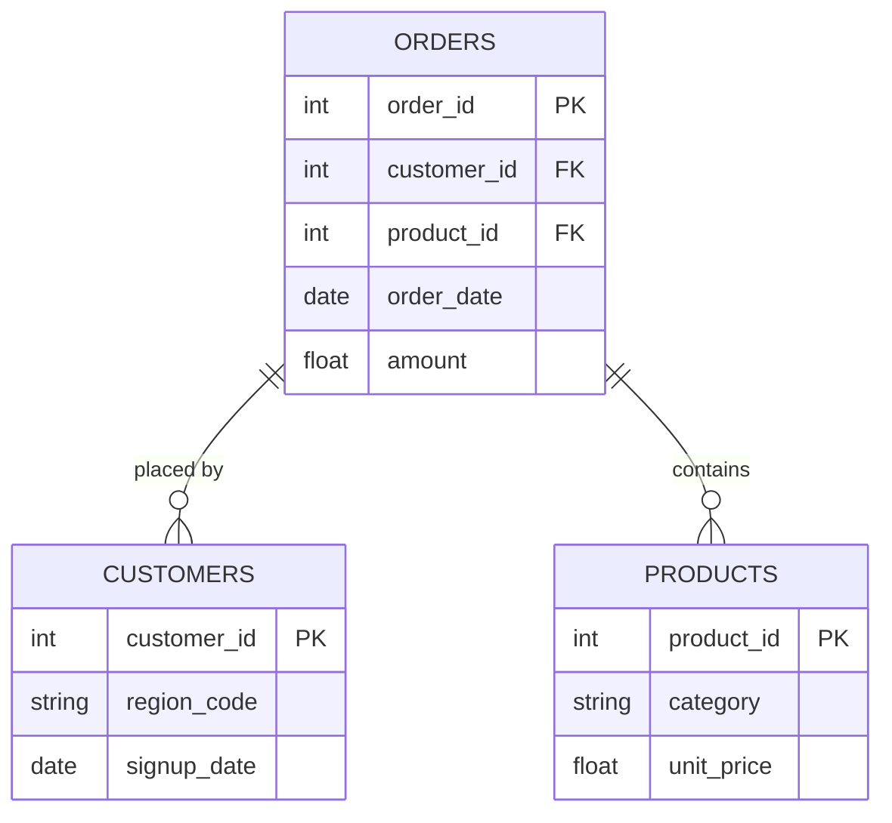

# Amazon E-Commerce Analytics & Executive Intelligence Dashboard
> *One sentence. What did you analyze, build, or solve - and why does it matter?*

---

## ⚙️ Project Type Flags
> *Check what applies. This helps reviewers and collaborators understand the nature of the work at a glance. Delete this block before publishing.*

-  Exploratory Data Analysis (EDA)
- [ ] SQL Analysis / Querying
-  Dashboard / Data Visualization
-  Data Pipeline / ETL
- [ ] Predictive Modelling / Machine Learning
-  Data Cleaning / Wrangling
- [ ] End-to-End (multiple of the above)
- [ ] Other: ___________

---

## Table of Contents
1. [Project Overview](#1-project-overview)
2. [Objectives](#2-objectives)
3. [Project Scope & Tools](#3-project-scope--tools)
4. [Repository Structure](#4-repository-structure)
5. [Data Workflow](#5-data-workflow)
6. [Data Model & Schema](#6-data-model--schema)
7. [ERD - Entity Relationship Diagram](#7-erd--entity-relationship-diagram) *(SQL projects)*
8. [Analysis & Metrics](#8-analysis--metrics)
9. [Key Insights](#9-key-insights)
10. [Recommendations](#10-recommendations)
11. [Assumptions & Limitations](#11-assumptions--limitations)
12. [Future Enhancements](#12-future-enhancements)
13. [Deliverables](#13-deliverables)
14. [Author](#14-author)

---

## 1. Project Overview

**Context:** This project presents an end-to-end Executive Business Intelligence solution built in Power BI using a large-scale Amazon e-commerce dataset containing over 1 million transaction records. The dashboard was designed to provide decision-makers with a centralized view of marketplace performance across sales, customers, products, sellers, inventory, and logistics operations.

The solution transforms data into actionable insights, enabling stakeholders to monitor business performance, identify growth opportunities, evaluate operational efficiency, and support strategic decision-making.

**Problem Statement:** E-commerce organizations generate large volumes of transactional data across multiple business functions. However, without a unified analytics platform, it becomes difficult to; monitor revenue and order performance, identify high-value customers and retention trends, evaluate product and seller effectiveness, detect inventory and fulfillment risks and to understand return behaviour and operational bottlenecks.

**Outcome:** The final solution delivers a scalable executive reporting framework that enables leadership to monitor marketplace performance, improve operational efficiency, optimize customer retention strategies, and support data-driven decision-making across the e-commerce value chain.

---

## 2. Objectives

- Analyze revenue performance across categories, locations, and sales channels.
- Segment customers based on purchasing behaviour and value contribution.
- Evaluate repeat purchase patterns and customer retention.
- Assess product and seller performance.
- Monitor inventory availability and operational efficiency.
- Identify delivery delays and return-risk hotspots.
- Deliver actionable insights through an executive-level dashboard experience.

---

## 3. Project Scope & Tools

### Scope

| Dimension | Details |
|-----------|---------|
| **In Scope** | Synthetic Amazon-style e-commerce transaction dataset, with 1 million rows, 20 columns, for 5 cities in India, Mar 2024-                  Mar 2026.
                Analysis covers revenue, return rates, payment method, product category, customer and seller performance.|
| **Out of Scope** | Customer demographics and marketing spend data were excluded -
                     demographic data was incomplete for two cities, and marketing
                     data sits in a separate system outside this engagement. |
| **Time Period** | March 2024-March 2026 |

### Tools & Technologies


| Category | Tool(s) Used |
|----------|-------------|
| Data Storage | CSV files |
| Data Processing | Power Query |
| Analysis | DAX |
| Visualization | Power BI |
| Version Control |  Git / GitHub |
| Documentation | Markdown |

---

## 4. Repository Structure

```
Amazon-ECommerce-PowerBI-Analytics/
│
├── data/                  
│   ├── ecommerce_dataset.csv
│
├── reports/                  
│   ├── Amazon_Ecommerce_Analytics_Executive_Intelligence_Dashboard.pbix
│
├── visuals/                  
│   ├── Executive_Overview.png
│   ├── Customer_Insights.png
│   ├── Product_Seller_Intelligence.png
│   ├── Operations_Delivery.png
│
├── documentation/            
│   ├── Data_Model.png
│
└── README.md                 
```

---

## 5. Data Workflow

<!--
  Show how data moved through your project - from source to output.
  Every transformation decision should be traceable here.

  WHAT GOOD LOOKS LIKE:
  1. Source: "Monthly CSV exports pulled from the internal POS system.
              Five files, one per region, covering Jan 2023–Jun 2024."
  2. Ingestion: "Loaded into Python using pandas. Files concatenated into
                 a single dataframe (approx. 340,000 rows)."
  3. Cleaning: "Removed 1.2% of rows with null transaction IDs.
                Standardised date formats across regional files.
                Resolved product category naming inconsistencies (3 variants → 1)."
  4. Transformation: "Created a returns_rate field at product-category level.
                      Aggregated to weekly and regional grain for trend analysis."
  5. Analysis: "Descriptive statistics, regional comparison, return rate
                segmentation by product category."
  6. Output: "Summary report (PDF), annotated notebook, processed CSV."

  WHAT TO AVOID:
  ❌ "Data was cleaned and analysed." (No chain. No decisions. No trust.)
-->

```
[Data Source(s)]
      ↓
[Ingestion / Collection Method]
      ↓
[Cleaning & Transformation]
      ↓
[Analysis / Modelling / Querying]
      ↓
[Output / Visualisation / Reporting]
```

1. **Source:** [Where did the data come from? Format, size, access method.]
2. **Ingestion:** [How was it brought in?]
3. **Cleaning:** [What issues did you find and fix?]
4. **Transformation:** [What new fields, aggregations, or structures did you create?]
5. **Analysis:** [What methods - statistical, visual, query-based, model-based?]
6. **Output:** [What form do the results take?]

---

## 6. Data Model & Schema

<!--
  Define your fields so that someone reading your analysis can follow along
  without digging through your code.

  WHAT GOOD LOOKS LIKE (one row example):
  | transaction_id | string | Unique identifier per sales transaction | TXN-00482 |
  | return_flag    | boolean | Whether the transaction included a return | TRUE |
  | region_code    | string | Two-letter identifier for store region | "NE" |

  WHAT TO AVOID:
  ❌ Skipping this section because "the field names are self-explanatory."
     They're not. Not to a reviewer. Not to you in six months.

  📌 FOR SQL PROJECTS: If you have multiple tables, create one block per table.
     Describe join keys and relationships here. Your ERD (Section 7) will
     visualise what this section describes in text.

  📌 FOR NON-SQL PROJECTS: Describe the shape of your dataset informally
     if a formal schema doesn't apply. Even one paragraph is more helpful than nothing.
-->

### Dataset / Table: `[name]`

| Field Name | Data Type | Description | Example Value |
|------------|-----------|-------------|---------------|
| `[field_1]` | [string / int / date / float / boolean] | [What this field represents] | [Non-sensitive example] |
| `[field_2]` | [string / int / date / float / boolean] | [What this field represents] | [Non-sensitive example] |
| `[field_3]` | [string / int / date / float / boolean] | [What this field represents] | [Non-sensitive example] |

> **Row count (approx.):** [X rows]
> **Date range:** [Start] – [End]
> **Key join / relationship:** [e.g., `orders.customer_id` → `customers.id`]

*Add additional table blocks as needed for multi-table projects.*

---

## 7. ERD - Entity Relationship Diagram
### *(Primarily for SQL Projects - remove this section if not applicable)*

<!--
  An ERD shows how your tables connect to each other visually.
  It is the fastest way for a reviewer to understand the data structure
  of a SQL project without reading every query.

  HOW TO INCLUDE YOUR ERD:
  Option A - Image embed (most common):
    Export your ERD from dbdiagram.io, DBeaver, Lucidchart, or similar.
    Save to /visuals/erd.png and reference it below.

  Option B - dbdiagram.io code block (version-controllable):
    Paste your schema definition code directly in the fenced block below.
    Anyone can paste it into dbdiagram.io to regenerate the visual.

  Option C - Mermaid diagram (renders natively in GitHub):
    Use the mermaid code block syntax below.
    GitHub will render this as a diagram automatically.

  PICK ONE. Don't use all three. Delete the options you don't use.
-->

### Option A - Embedded Image

*[Brief caption: e.g., "Three-table schema - orders, customers, and products joined on shared IDs."]*

---

### Option B - dbdiagram.io Schema Definition
```
Table orders {
  order_id    int     [pk]
  customer_id int     [ref: > customers.customer_id]
  product_id  int     [ref: > products.product_id]
  order_date  date
  amount      float
}

Table customers {
  customer_id int  [pk]
  region_code string
  signup_date date
}

Table products {
  product_id   int    [pk]
  category     string
  unit_price   float
}
```
*Paste this into [dbdiagram.io](https://dbdiagram.io) to view the visual.*

---

### Option C - Mermaid Diagram *(renders on GitHub)*


---

**Table Relationships Summary:**

| Relationship | Join Key | Type |
|-------------|----------|------|
| `orders` → `customers` | `customer_id` | Many-to-One |
| `orders` → `products` | `product_id` | Many-to-One |
| [Add rows as needed] | | |

---

## 8. Analysis & Metrics

<!--
  Explain what you measured and how - before you share what you found.

  WHAT GOOD LOOKS LIKE:
  Metric: "Customer Return Rate"
  Definition: "Number of transactions flagged as returns divided by total
               transactions, calculated at product-category and regional grain."
  Why It Matters: "Return rate - not sales volume - was hypothesised to
                  explain regional revenue gaps. This metric tests that hypothesis."

  WHAT TO AVOID:
  ❌ Defining a metric only in code: SUM(returns) / COUNT(transaction_id)
     That's an implementation. Write the plain-language definition here.
     Both belong in your project - the definition in the README,
     the implementation in the code.
-->

### Analytical Approach

[Describe how you approached the analysis. Were you exploring patterns? Testing a hypothesis? Building and validating a pipeline? Be honest about your method - exploratory work is valid, just call it that.]

### Key Metrics Defined

| Metric | Plain-Language Definition | Why It Matters |
|--------|--------------------------|----------------|
| `[Metric 1]` | [What it measures, in one sentence] | [What decision or question it answers] |
| `[Metric 2]` | [What it measures, in one sentence] | [What decision or question it answers] |
| `[Metric 3]` | [What it measures, in one sentence] | [What decision or question it answers] |

### Methods Used

- [e.g., Descriptive statistics - distribution, central tendency, outlier detection]
- [e.g., Trend analysis across [time period]]
- [e.g., Segmentation / group comparison by [dimension]]
- [e.g., Correlation analysis between [variable A] and [variable B]]
- [e.g., SQL window functions for [specific aggregation]]
- [e.g., Custom aggregation or transformation logic in [tool]]

---

## 9. Key Insights

<!--
  Findings + implications. Not just what happened - what it means.

  WHAT GOOD LOOKS LIKE:
  ✅ "Return rates, not sales volume, explain Region A's underperformance.
      Region A's return rate on home goods was 34% - more than double the
      company average. Revenue was not lost at the point of sale; it was
      lost post-sale through refunds. This points to a fulfilment or
      product quality issue specific to that region, not a demand problem."

  WHAT TO AVOID:
  ❌ "Region A had lower revenue than other regions in Q4."
     (That's an observation. It describes what happened.
      An insight says what it means and where to look next.)

  Aim for 3–6 insights. Quality over quantity.
-->

**Insight 1: [Short descriptive headline]**
[What you found + what it suggests. One short paragraph.]

**Insight 2: [Short descriptive headline]**
[What you found + what it suggests.]

**Insight 3: [Short descriptive headline]**
[What you found + what it suggests.]

**Insight 4 (if applicable): [Short descriptive headline]**
[What you found + what it suggests.]

---

## 10. Recommendations

<!--
  Action-oriented. Addressed to a real audience.
  Tied explicitly to the insight that supports each one.

  WHAT GOOD LOOKS LIKE:
  Priority: High
  Recommendation: "Conduct a fulfilment audit for home goods deliveries
                   in Region A - specifically investigating whether returns
                   correlate with a particular warehouse, carrier, or SKU batch."
  Based On: Insight 1 - return rate anomaly in Region A
  Owner: Operations / Supply Chain team

  WHAT TO AVOID:
  ❌ "Improve the return rate."
     (Not actionable. Doesn't say who, how, or where to start.)
  ❌ "Further analysis is needed."
     (This is a placeholder, not a recommendation.)
-->

| Priority | Recommendation | Based On | Suggested Owner |
|----------|---------------|----------|-----------------|
| High | [Specific, actionable step] | [Insight it comes from] | [Who should act] |
| Medium | [Specific, actionable step] | [Insight it comes from] | [Who should act] |
| Low | [Exploratory or longer-term suggestion] | [Insight it comes from] | [Who should act] |

---

## 11. Assumptions & Limitations

<!--
  WHAT GOOD LOOKS LIKE:
  Assumption: "Transaction records were assumed to be complete for all five regions.
               No validation was performed against source system record counts."
  Limitation: "The analysis cannot distinguish between returns initiated by
               the customer vs. returns initiated by the business (e.g., recalls).
               If business-initiated returns are concentrated in Region A, the
               return rate finding may reflect a policy decision, not a quality issue."

  WHAT TO AVOID:
  ❌ Leaving this section blank or writing "None known."
     Every project has limitations. Documenting them is a sign of
     analytical maturity - not a confession of failure.
-->

### Assumptions
- [What did you treat as true without being able to verify?]
- [What simplifications did you make for scope or feasibility?]
- [What domain rules or definitions did you accept as given?]

### Limitations
- [What gaps exist in the data?]
- [What analysis was out of scope but could affect interpretation?]
- [What would a more rigorous version of this project include?]
- [Are there known biases in the data source or collection method?]

> *The goal here is pre-emptive Q&A. What would a thoughtful skeptic push back on? Document the answer here, before they ask.*

---

## 12. Future Enhancements

<!--
  WHAT GOOD LOOKS LIKE:
  ✅ "Automate the monthly data pull from the POS export folder using
      a scheduled Python script, replacing the current manual process."
  ✅ "Expand the return rate analysis to include carrier-level data,
      which was unavailable in this dataset but exists in the logistics system."

  WHAT TO AVOID:
  ❌ "Add a machine learning model."
     (Vague, and disconnected from the actual findings of this project.)
  ❌ Listing aspirational features that don't follow logically from the work.
-->

- [ ] [Enhancement 1 - specific and traceable to a real gap in this project]
- [ ] [Enhancement 2]
- [ ] [Enhancement 3]
- [ ] [Enhancement 4]

---

## 13. Deliverables

| Deliverable | Description | Location |
|-------------|-------------|----------|
| [Name] | [What it contains] | [`/path/to/file`] |
| [Name] | [What it contains] | [`/path/to/file`] |
| [Name] | [What it contains] | [`/path/to/file`] |

---

## 14. Author

**[Your Name]**
[Your role or title - current or target]

- 🔗 [LinkedIn URL]
- 💼 [Portfolio or GitHub profile URL]
- 📧 [Email - optional]

---

*Last updated: [Month YYYY]*
*If this template helped you, consider starring the repository.*
